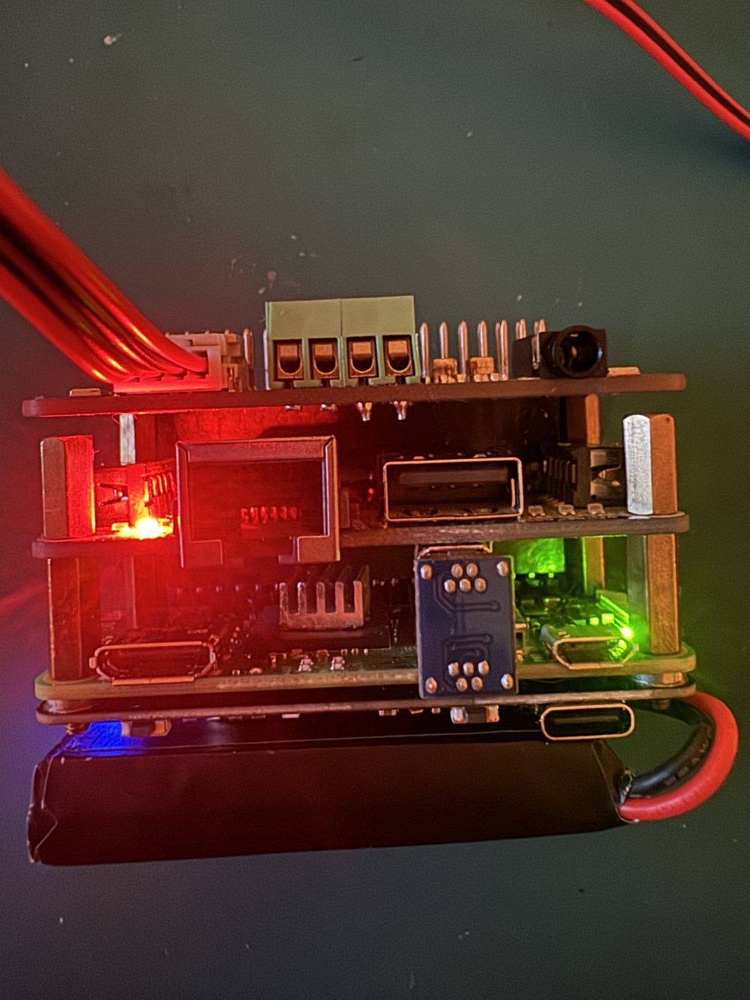

# Pi Voice Assistant · SERVITOR

**Deutscher Sprachassistent auf einem Raspberry Pi Zero 2 W** mit WM8960-Audio, Button SHIM, Adafruit mini PiTFT (240 × 240) und PiSugar 3. Er spricht als **Servitor Proximus** oder **Billy** – mit wählbarer Lore und Stimmeffekt.

| Hardware-Aufbau | Status auf dem PiTFT |
|:--:|:--:|
|  |  |

*Links: echtes Projektfoto. Rechts: gerenderte Software-Vorschau, kein Foto des Displays.*

## So funktioniert es

```text
Taste halten / „Hey Jarvis“ → Pi: Audio, Tasten, Display
  → CT 107: Vosk → direkte Antwort / OpenRouter / lokales Qwen3-4B
  → Piper + Servitor-DSP → Pi → WM8960-Lautsprecher
```

**Funktionen:** PTT und Wake Word, Display-Menü, Wetter (Fünf-Tage-Vorhersage), Morgenbericht, Nextcloud-CalDAV-Termine, Gerätesteuerung, Alarme, Gedächtnis auf USB-Stick, mehrere Stimmprofile und Servitor/Billy-Persönlichkeit. Die [Roadmap](docs/roadmap.md) trennt implementierte Funktionen von **noch offenen Hardware-Abnahmen**.

**Offline-Grenzen:** Ohne Internet, aber mit CT 107, beantwortet Qwen3-4B freie Fragen lokal im Homelab. Ohne CT 107 nutzt der Pi Vosk, Piper und direkte Antworten; freie Fragen benötigen dann OpenRouter und Internet. **Auf dem Pi Zero 2 W läuft kein Offline-LLM.**


*Animation aus dem Display-Code; die Abnahme am echten PiTFT steht teilweise noch aus.*

## Schnellstart und Betrieb

Auf dem **bereits eingerichteten Pi**:

```bash
systemctl status pi-ptt pi-display --no-pager
journalctl -u pi-ptt -n 40 --no-pager
```

Für eine Neuinstallation: [Setup](docs/setup.md). Für den Betrieb und Deployments: [Operation](docs/operation.md). Bei Problemen: [Troubleshooting](docs/troubleshooting.md).

| Bereich | Dokumentation |
|---|---|
| System | [Architektur](docs/architecture.md) · [Hardware & Fotos](docs/hardware.md) |
| Bedienung | [Tasten und Menü](docs/features/controls.md) · [Display](docs/features/display.md) |
| Sprache | [Vosk, LLM und Piper](docs/features/speech.md) |
| Persönliches | [Gedächtnis & Stimmprofile](docs/features/memory.md) · [Servitor & Billy](docs/features/personality.md) |
| Betrieb | [Wartung](docs/features/maintenance.md) · [Roadmap](docs/roadmap.md) |
| Hintergrund | [ADRs](docs/decisions/) · [Historische Prüfungen](docs/history/) · [Konzepte](docs/concepts/) |

Konfiguration: `/etc/pi-ptt.env` (Tasten/Modi), `/etc/pi-voice-assistant.env` (Pi/Server-Zugangsdaten), `/etc/servitor-voice.env` (CT 107). **Keine Tokens oder App-Passwörter ins Repository.** Der LAN-Zugriff ist HTTP mit Bearer-Token (im LAN unverschlüsselt), der Cloudflare-Zugriff erfolgt über HTTPS ([ADR 0004](docs/decisions/0004-servitor-server.md)).

**Stand 10.10.2026:** Der separate [PR #79](https://github.com/0b-ivan/pi-voice-assistant/pull/79) (Log-Selbsttest) ist noch **nicht** in diesem dokumentierten `main`-Stand.
