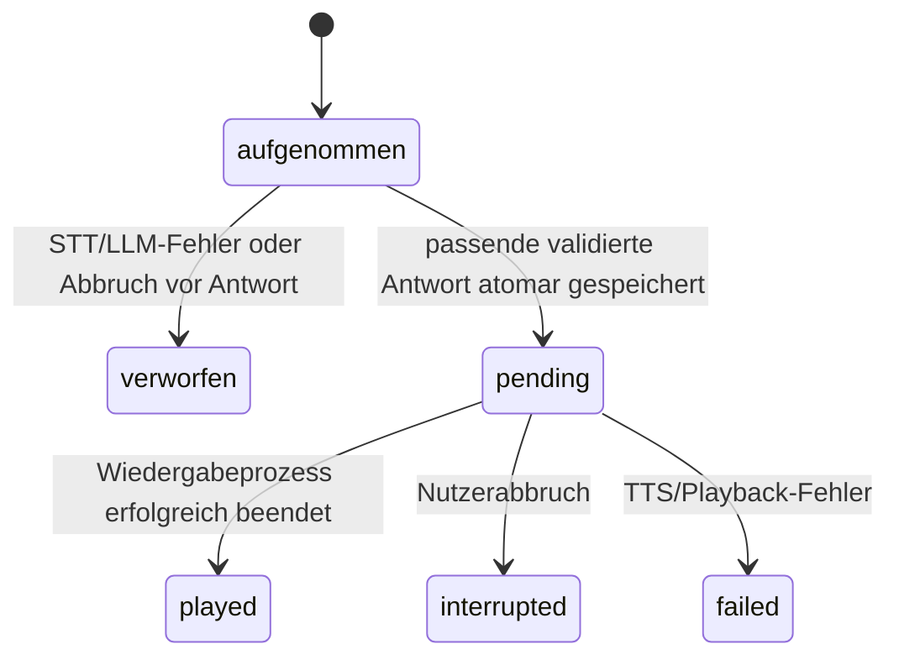

# Proximus: dauerhafter Gesprächskontext auf dem Erinnerungskern

Status: überarbeitetes Konzept und ausführbare Offline-Referenz für PR #92; keine aktive Runtime-Funktion. Überarbeitung 11.10.2026. Repository geprüft gegen `main` `0e5bd33`; Hardware- und Kogitator-Korrekturen aus PR #90, #91 und #93 sind berücksichtigt. [Recherche und Entscheidungskritik](RECHERCHE_UND_ENTSCHEIDUNGEN.md) dokumentieren sechs vergleichbare Lösungen und begründen die Änderungen. [Claude-Auftrag](CLAUDE_AUFTRAG.md) ist die Implementierungsanweisung. [Sechs zusätzliche Dialogfunktionen](DIALOGFUNKTIONEN.md) ergänzen dieses Konzept verbindlich.

## 1. Problem und Architekturentscheidung

Proximus soll „Und Sonntag?“ im Zusammenhang mit einer früheren Reiseanfrage verstehen und den Zusammenhang nach einem Neustart weiterführen können. Gleichzeitig darf eine gespeicherte Fahrplanantwort nicht als aktueller Fahrplan gelten.

Der aktuelle Code besitzt bereits `MemoryCore`: Fakten, Direktiven und sechs Fragen-/Antwortpaare in einer atomaren JSON-Datei auf dem PROXIMUS-Stick. Vier Paare gehen an das Modell; `clean_text()` kürzt beide Teile auf jeweils 200 Zeichen. `_chat()` unterstützt Verlauf für Cloud und lokale Antwort. `dialog.hints()` behandelt einige Folgefragen und Personawechsel. SPX hält auf dem Server eine begrenzte Sitzungskopie. Es fehlt ein expliziter Gesprächsstand mit Quellen, gezieltem Abruf, sauberer Löschung und persönlicher Zuordnung.

Wir erweitern diesen Pfad um drei Ebenen: **Originalverlauf auf dem Stick**, **kleinen aktuellen Arbeitsstand**, **ausgewählten Kontext für genau eine Modellanfrage**. Dauerhafte Nutzerfakten und Direktiven bleiben eigene Kategorien. Nur der Pi schreibt; Server hält Kontext und optional temporäre Audiodaten im RAM. Keine neue Cloud-Gedächtnisablage.

Die Trennung folgt den Mustern aus [LangGraph](https://docs.langchain.com/oss/python/concepts/memory) und [Letta](https://github.com/letta-ai/skills/blob/main/letta/agent-development/references/memory-architecture.md). Die folgenden konkreten Grenzwerte und Integrationsentscheidungen sind unsere Anpassung an das bestehende Projekt, keine übernommenen Leistungszusagen.

## 2. Verhalten aus Sicht des Bedieners

- Fragen innerhalb eines aktiven Gesprächs nutzen den letzten Verlauf, den Arbeitsstand und passende ältere Quellen. Proximus und Billy teilen diesen freigegebenen Inhalt, die aktuell gewählte Persona bestimmt den Stil.
- Neustart mit demselben Stick lädt den Zustand wieder; nichts wird automatisch gesprochen oder ausgeführt. Ohne Stick kein neuer Inhaltsverlauf, kein SD-Ersatzspeicher.
- „Neues Gespräch“ beginnt einen eigenen Thread und archiviert den bisherigen innerhalb der sichtbaren Quoten. „Vergiss dieses Gespräch“ löscht den aktuellen Thread. Wechsel und Löschen sind unterschiedliche Aktionen.
- „Setze unser Gespräch fort“ reaktiviert das zuletzt ausgewählte Gespräch. Bei mehreren plausiblen alten Gesprächen fragt Proximus einmal konkret nach dem Thema.
- „Was war unser Thema?“ gibt einen kurzen Bericht aus belegtem Zustand. Bei einem alten Zustand benennt er, dass dies das frühere Thema war.
- Nach 12 Stunden ohne Turn werden an eine neue unklare Anfrage keine alten Verlaufspaare automatisch angehängt. Die Zeitgrenze löscht nichts und eröffnet nicht automatisch einen neuen Thread. Eine ausdrückliche Fortsetzung setzt im Controller die Abruffreigabe für diesen Thread bis zum nächsten erfolgreichen Turn; anschließend gilt dessen neuer Zeitstempel. Klare Fortsetzung oder eindeutig benanntes altes Thema darf den Thread reaktivieren. „Und morgen?“ ohne sicheren Bezug führt zu einer Rückfrage.
- „Vergiss Hamburg“ löscht nach eingegrenzter Auswahl passende Quellen und daraus abgeleiteten Kontext; unabhängige Threads bleiben bestehen. Kein Treffer bedeutet keine Löschung. Mehrdeutige Anfrage wird durch eine kurze Rückfrage eingegrenzt.

Ein bloßer Themenwechsel innerhalb einer normalen Frage erzeugt keine ungetestete automatische Klassifikation. Explizite Threadwechsel sind im MVP zuverlässig; eine semantische Themensteuerung wäre erst nach echten Dialogtests zu ergänzen.

## 3. Identität und persönliche Namespaces

Profil-ID, Gesprächs-ID, Turn-ID, Persona und Netzwerksitzung haben unterschiedliche Aufgaben:

| ID / Wert | Zweck |
|---|---|
| `profile_id` | stabile Personenkennung, zufällige UUID im Stimmprofil |
| `conversation_id` | genau ein inhaltlicher Thread dieser Person |
| `turn_id` | genau eine Nutzereingabe und die dazu generierte Antwort |
| `epoch` / `revision` | Löschbarriere und Stand des Inhalts |
| `mount_generation` | Dateisystem-UUID plus neue Verbindungskennung pro Mount |
| SPX-Session-ID | zeitlich begrenzter Transportcache, keine Personenkennung |
| `servitor` / `mensch` | Stil/Herkunft der Antwort, keine Berechtigung |

Namen und Dateislugs sind veränderbar und dürfen keine Schlüssel für Zugriffsrechte sein. Alte Stimmprofile erhalten atomar eine UUID; Nachtrainieren/Umbenennen bewahren sie. Löschen eines Profils entfernt seine Conversation-Namespaces oder bietet nach bestehender Personenverwaltung eine eindeutig benannte Löschaktion. Globale Legacy-Fakten werden nicht still einzelnen Personen zugeordnet.

**Mehrere Profile werden unterstützt**, sobald die Anfrage sicher einer stabilen Profil-ID zugeordnet ist. Unbekannte, zu kurze, mehrdeutige oder technisch ungeprüfte Stimmen erhalten keinen persönlichen Gesprächskontext und dürfen ihn nicht schreiben. Ohne registrierte Profile bleibt der bisherige lokale Gerätebediener als `device-operator` nutzbar. Lokaler Rückfall mit Profilen braucht eine aktuelle freigegebene Identität für genau diese Eingabe; eine alte Serverentscheidung genügt nicht. Bei fehlender Erkennung nur unpersönlich antworten. Stimmerkennung bleibt fehlbar und ist kein neuer Nachweis sicherer Authentifizierung.

### Erkennung vor Kontextauswahl: konkrete Transportfolge

Das heutige Server-`_identify()` kennt Stimmen erst nach Audioempfang; der Pi hat den Memory-Header bereits geschickt. Es darf daher nicht einfach der letzte aktive Owner verwendet oder der komplette Personenbestand im Header gesendet werden.

Vorgeschlagene Erweiterung ausschließlich für Clients mit Capability `speaker_context_v2`:

1. Pi streamt dieselbe Aufnahme an einen neuen temporären `POST /v1/identify-turn`; dabei nur Stimmprofile/IDs und Gerätedaten, keine persönlichen Gespräche/Fakten.
2. Server bildet das vorhandene Embedding. Ergebnis enthält `profile_id` oder `unknown`, eine zufällige opaque Ticket-ID und Audio-Hash. Aufnahme bleibt höchstens 30 s im Server-RAM; maximal 2 Aufnahmen pro Gerät, insgesamt 16, jeweils durch bestehende Audio-Längen-/Bytegrenzen beschränkt. Kein Diskspool. Ticket an Session/Gerät und Hash binden.
3. Bei erkannter Person wählt der Pi deren Namespace und lädt/packt den begrenzten Kontext. `POST /v1/turn-from-ticket` erhält Ticket plus persönlichen Kontext. Server verwendet die schon vorhandene Aufnahme, prüft Profil-ID/Ticket/Session/Hash und erzeugt die Antwort. Keine doppelte Audiouploadstrecke und kein zweites Embedding.
4. Bei unbekannter Stimme nur Gastkontext. Ticket verbrauchen; Antwort/Memory-Ereignisse tragen verifizierte Profil-ID, Turn-ID und Snapshot. Pi akzeptiert ausschließlich passende Ergebnisse.
5. Falls Ticket nach Fehler verbraucht ist, keinen Aktions-Turn ungeprüft wiederholen. Neuer kontrollierter Versuch oder unpersönlicher Rückfall. Server-Neustart verwirft Tickets und Sitzungen.

Das ist ein neuer LAN-Roundtrip und muss gemessen werden; die erste Fassung hatte diese Integrationskosten unterschätzt. Für Clients/Server ohne Capability bleibt der bestehende Weg erhalten, neuer persönlicher Conversation-Kontext bleibt dort aus. Den aktuellen globalen Faktenpfad separat prüfen: Er ist heute nicht bereits personenbezogen isoliert.

## 4. Datenmodell, Speicherquoten und Herkunft

`memory.json` behält Root-Version/Fakten/Direktiven; neues optionales Feld `conversations` mit eigener Version 2. Version 1 bezeichnet die frühere Offline-Referenz, keine behauptete produktive Migration. Eine unbekannte Version niemals überschreiben.

```json
{
  "version": 1, "facts": [], "directives": [], "history": [],
  "conversations": {
    "version": 2,
    "owners": {
      "profile-uuid": {
        "active": "conversation-uuid",
        "threads": [{
          "version": 2, "id": "conversation-uuid", "owner": "profile-uuid",
          "updated_at": 1791705600, "epoch": 0, "revision": 1, "discarded": 0,
          "turns": [{
            "id": "turn-uuid", "q": "Am Samstag nach Hamburg vor 11 Uhr.",
            "a": "Von welchem Startbahnhof?", "p": "servitor", "at": 1791705600,
            "delivery": "pending", "context_ids": []
          }],
          "slots": {
            "destination": {"source_id":"turn-uuid","start":16,"end":23,"quote":"Hamburg"}
          },
          "seen": ["turn-uuid"]
        }]
      }
    }
  }
}
```

Alle `start/end` beziehen sich auf den tatsächlich gespeicherten normalisierten Nutzertext (Unicode-Zeichen, kein Byteoffset). Das Beispiel ist illustrativ. Die Runtime vergibt IDs und kontrolliert Quellen.

| Bereich | Voreinstellung | Wirkung |
|---|---:|---|
| Personen | 5 | entspricht begrenztem Profiltransport; weitere Profile nicht still verdrängen |
| Threads je Person | 3 | aktueller und höchstens zwei frühere |
| Originalrunden je Thread | 48 | deutlich mehr als der normale Prompt enthält |
| Frage/Antwort je Runde | je 2048 Zeichen | eigene Grenze, keine still abgeschnittene Speicherung |
| Arbeitsstand | 8 benannte Felder, je bis 400 Zeichen | Quellenzitate, keine frei erfundene Biografie |
| Conversation-JSON je Person | 128 KiB UTF-8 | älteste inaktive Threads, dann älteste aktive Runden entfernen |
| gesamte Conversation-Ablage | ungefähr ≤640 KiB plus Index | 5 separate Quoten; Fakten/Voice-Dateien zusätzlich |
| Duplikat-IDs je Thread | 128 | zusätzliche Hilfe, Snapshot ist Hauptschutz |
| offene Rückfragen | maximal 3 | Assistant-Quelle und Status getrennt von Nutzerfakten |
| Zeitreferenzen je Turn | maximal 4 | festes Datum/Zeit mit Äußerungsbezug und Zeitzone |
| Gesprächstitel | bis 60 Zeichen | nur eigene Archive, keine Namensverwechslung |
| jüngster Promptverlauf | höchstens 4 ganze Paare | keine verwaisten Rollen |
| zusätzliches Belegmaterial | erste erhaltene Anfrage plus höchstens 2 Worttreffer | nur aktiver/ausdrücklich fortgesetzter Thread |
| exportierte JSON-Kopie | 6000 Zeichen | inklusive Schlüssel und Metadaten |
| Base64-Header | 12000 ASCII-Zeichen | UTF-8-Auswirkung tatsächlich zählen |
| Modellbudget | pro realem Modell | gesamte Nachrichten + Ausgabe + Sicherheitsreserve |

Quoten sind **Aufbewahrungsgrenzen**, kein Versprechen unbegrenzter Erinnerung. Verdrängungen als Metadaten erfassen (`discarded`, archivierte Threadanzahl) und in „Was ist gespeichert?“ sichtbar machen. Andere Personen dürfen nicht durch neue Daten eines Owners verdrängt werden. Quellen aktiver Arbeitsfelder bei der Aufbewahrung bevorzugt halten; zuerst nicht gebundene alte Runden verdrängen. Die Bytequote bleibt hart: falls nur gebundene Quellen übrig sind, darf auch die älteste davon entfernt werden. Karten verlieren ihre Gültigkeit, wenn ihre Originalquelle verdrängt oder gelöscht ist. Nicht heimlich den Satzanfang als vollständigen Text speichern: überlange Eingaben gezielt in Story-/Auftragszustand umleiten oder ausdrücklich als nicht vollständig speicherbar melden.

JSON bleibt für diesen begrenzten ersten Ausbau der vorhandene Speicher. Bei jeder Mutation wird die Rootdatei atomar neu geschrieben; die Worst-Case-Latenz und Cachekopien sind auf dem Pi zu messen. Kein Leistungsversprechen aus der Offline-Referenz. Ein späterer SQLite-Ausbau wäre gerechtfertigt, wenn reale Messung oder größere Aufbewahrung den Bedarf zeigt; dafür gäbe es einen eigenen Migrations-PR.

## 5. Arbeitsstand: sinnvolle Zusammenfassung mit überprüfbaren Quellen

Die frühere FIFO-Liste kurzer Zitate wird ersetzt. Arbeitsstand ist ein kleines Blatt, beispielsweise `goal`, `destination`, `date`, `arrival`, `constraints`, `decision`. Offene Rückfragen stehen in einer separaten, assistantbelegten `questions`-Liste gemäß `DIALOGFUNKTIONEN.md`. Es übernimmt Nutzerangaben wörtlich aus konkreten Quellen. Eine neue belegte Angabe desselben Felds ersetzt dessen aktuellen Wert; ältere Runden bleiben ausdrücklich historisch. Das übernimmt die Idee zeitlicher Ablösung aus [Graphiti](https://github.com/getzep/graphiti/blob/main/README.md), ohne Graphdatenbank.

**Optionaler Update-Vertrag im selben normalen Antwortaufruf:** Ein Modell, das einen geprüften strukturierten Antwortmodus unterstützt, liefert gesprochene Antwort plus kleine Quellen-Selektoren. Beispiel:

```json
{"reply":"Dann planen wir mit Berlin.",
 "context_update":{"destination":{"source_id":"current-turn-id","start":0,"end":6}}}
```

Server/Pi prüfen Version, Schlüssel, Feldanzahl, ID, Bereich und aktuelle Revision. Nur aktuelle oder tatsächlich exportierte Quellen der **gleichen Person/des gleichen Threads** zulassen. Nur `q`, niemals Modellantworten als Nutzerfakten. Ältere Quellen dürfen neuere Feldwerte nicht wieder überschreiben. Kein Update darf Besitzer, Aktionen, Sicherheitsregeln oder Direktiven ändern. Der Inhalt wird erst mit erfolgreichem Antwort-Commit gespeichert.

Quellenprüfung garantiert Herkunft, keine richtige semantische Interpretation: Das Modell kann ein echtes Wort dennoch dem falschen Feld zuordnen. Darum Extraktion nur nach freigegebenem Modelltest aktivieren und keine beliebige JSON-Anhängung ungeprüft sprechen. Antwort-Envelope von vorhandenen MERKE-/Stimmungstags sauber trennen. Bei ungültigem/fehlendem Update Antwort speichern, Update verwerfen und auf Originalauswahl zurückfallen; **kein zweiter Modellaufruf zur Reparatur**. Persönliche dauerhafte Fakten entstehen weiterhin ausschließlich über den dafür vorgesehenen Pfad.

**Grundfunktion ohne Extraktion:** letzte Paare, erste erhaltene Threadanfrage und relevante alte Nutzertexte. Das hält das ursprüngliche Ziel länger verfügbar, ist aber keine semantische Zusammenfassung. Deutsche Wortsuche findet keine beliebigen Synonyme. Fehlt ein klarer Bezug, nachfragen. Erst reale Dialogprüfung entscheidet über spätere bessere Extraktion oder Suche.

## 6. Auswahl und drei voneinander unabhängige Budgets

Originaldaten werden vor dem Modellaufruf ausgewählt, nicht durch Transportkürzung aus dem Stickbestand gelöscht. Ablauf:

1. Person und aktiven/ausdrücklich gewählten Thread prüfen. Keine automatische Suche über andere Personen oder alle Archive.
2. Vier jüngste Paare auswählen; historische Zeiten und Delivery-Status behalten.
3. Arbeitsstand mit Quellen übernehmen. Erste erhaltene Anfrage als Rückfallanker; bis zwei ältere Treffer über normalisierte Wortüberlappung und Aktualität wählen. Auswahl nach Löschung aus verbleibenden Quellen neu bilden.
4. Fakten separat nach Relevanz für aktuelle Frage/Arbeitsziel sortieren. Alte wichtige Fakten nicht wegen des Alters allein entfernen; nicht relevante dauerhafte Fakten nicht immer mitsenden. Bestehende explizite Direktiven und benötigte Voice-Daten behalten.
5. JSON-Zeichen und **fertigen** Base64-Header zählen. Zusätzlich den vollständigen Modellrequest mit Persona, Lore, Zeit, Tooldaten, aktuellem Prompt, Verlauf, Ausgabe- und Sicherheitsreserve zählen. Modellabhängigen Tokenizer verwenden, sofern verfügbar; dokumentierte konservative Modellheuristik sonst. „Vier Zeichen = ein Token“ gilt nicht allgemein.
6. Bei Überlauf optionale alte Belege, ältere ganze Paare, schwache Fakten und zuletzt optionale Arbeitsfelder entfernen. Letztes Paar und feste Daten nicht still verlieren: wenn das Minimum nicht passt, ausdrücklich Budget-Fallback auslösen. Neue Eingabe wird niemals von Memory-Trimming abgeschnitten.

Die Referenz verlangt dafür `model_fits(payload)` als Callback. Er muss in der Runtime die **vollen** Nachrichten zählen. Tests mit einem simulierten Callback beweisen den Mechanismus, keine echte Modell-Tokenzahl. Protokoll-Slim-Payload ist nicht dasselbe wie Modellkontextgröße.

Karten und Belege als JSON-Daten in einer klar bezeichneten Sektion injizieren, nicht als neue Systemautorität. Gegenwart hat Vorrang vor älterem Gespräch. Frühere Modellantworten sind Antwortgeschichte, kein Tatsachennachweis. Reale Hardwaredaten, Wetter, Fahrplan oder ausgeführte Aktionen weiterhin aus realen Quellen/Intents prüfen; aktuelle Hardware-Intents aus PR #90 erhalten. JSON-Abgrenzung verhindert Prompt Injection nicht garantiert. Werkzeugberechtigung bleibt im deterministischen Controller.

## 7. Generierter Turn, Playback und langlebiger Commit

Ein `reply` ist generierter Text, `done` ist ein Server-Lifecycle-Ereignis, und `speech_finished` mit Erfolg ist beobachteter Wiedergabeabschluss. Diese Zustände nicht gleichsetzen.



Der Pi committed nach vollständig empfangenem, validiertem Antworttext mit passendem Snapshot und ID. Ein späterer TTS-/Netzwerkfehler löscht eine bereits gültige generierte Antwort nicht. Audio-Status wird separat atomar aktualisiert, ohne neue Runde/Revision für denselben Inhalt anzulegen. Bei Neustart vorhandenes `pending` heißt „Wiedergabe nicht bestätigt“; nicht behaupten, es sei vorgelesen worden. `played` heißt erfolgreicher Wiedergabeprozess, nicht dass ein Mensch nachweislich zugehört hat.

„Was hast du gesagt?“ soll die zuletzt als `played` markierte Antwort wiederholen. Gibt es nur `pending/interrupted/failed`, ehrlich auf nicht bestätigte/abgebrochene Wiedergabe hinweisen und die vorhandene Antwort anbieten. Erneutes Vorlesen löst keine neue LLM-Anfrage aus. Story-Monologe bleiben in ihrer bestehenden gesonderten Queue; keine 20-Minuten-Texte in normalen Turnbestand packen.

Turn-ID vor Anfrage erzeugen; Wiederübertragung derselben logischen Anfrage behält sie. Snapshot enthält Owner, Thread, Epoch, Inhaltsrevision, Owner-`write_epoch` und Mount-Generation. Änderungen an Speicherpause oder dauerhaften Owner-Fakten erhöhen `write_epoch`. Änderungen an Inhalt, Wechsel, Vergessen oder Stick invalidieren alte Ergebnisse. Duplikat derselben ID im gleichen unveränderten Lösch-/Mountkontext ist No-op; neue ID mit veraltetem Snapshot wird verworfen. Nicht Modelldaten über Besitzer/Mount als wahr übernehmen.

## 8. Löschen, Fortsetzen und Cachebarrieren

| Spracheingabe | Verhalten |
|---|---|
| „Neues Gespräch“ / „Neues Thema“ | neuen Thread aktivieren, bisherigen begrenzt archivieren |
| „Vergiss dieses Gespräch“ / „Lösche diesen Gesprächsverlauf“ | aktuellen Thread samt Arbeitsstand entfernen, leeren aktivieren |
| „Vergiss alle unsere Gespräche“ | nur Conversation-Threads der berechtigten Person löschen; Fakten getrennt behandeln |
| „Setze unser Gespräch fort“ | aktuellen bzw. eindeutig gewählten früheren Thread reaktivieren |
| „Was war unser Thema?“ | kurzer Bericht aus aktuellen belegten Daten |
| „Vergiss Hamburg“ | passende Quellen/Fakten auswählen, abhängigen Kontext entfernen; ohne Treffer nichts löschen |

Gezielte Löschung nutzt stabile Quellen-IDs, wie die CRUD-Muster bei [Mem0](https://github.com/mem0ai/mem0/blob/main/docs/core-concepts/memory-operations/delete.mdx). Der erste Filter ist deterministische Wortsuche im Owner-Bestand; vorhandenen Faktenmatcher weiterverwenden. Das ist keine garantierte semantische Löschung jeder Paraphrase. Falls der Nutzer mehr meint, nach konkretem Thema/gesamtem Thread fragen. Niemals eine angeblich umfassende Löschung bestätigen, die nur Literaltext matcht.

Eine gelöschte Runde entfernt das ganze Frage-/Antwortpaar und alle Arbeitsfelder mit ihrer Quell-ID. Außerdem abhängige Folgerunden entfernen. Dafür beim Commit die **tatsächlich exportierten** Quell-IDs als `context_ids` speichern; bei Löschung transitive Abhängigkeiten berücksichtigen. Das ist konservativ: ein Turn kann denselben Export bekommen haben, ohne alle Inhalte zu benutzen. Die Ansage nennt deshalb Zahl der direkt und zusätzlich entfernten Folgerunden. Unabhängige Runden/Threads erhalten. Keine Text-Tombstones mit dem gelöschten Inhalt anlegen; Epoch erhöhen und Sessioncache invalidieren.

Löschung in einer Pi-Transaktion ausführen: Conversation-Quellen, abgeleitete Karten, passende zugeordnete Fakten/Direktiven und Legacy-Verlauf, soweit betroffen. Root-/Owner-Daten anderer Personen nicht anfassen. Session für betroffenen Namespace invalidieren und bei nächstem Turn vollständige freigegebene Kopie senden. Ein verspätetes Memory-/Reply-/Playback-Ereignis darf die gelöschten Quellen nicht wiederherstellen.

Erfolgsansage erst nach lokalem Commit. Der Server darf keine voreilige „gespeichert/gelöscht“-Ansage liefern. Bei fehlendem/read-only/vollem Stick ehrlich scheitern. Alte unabhängige Logs, Backups und bereits gesendete Providerdaten sind davon nicht nachweislich gelöscht; Dokumentation keine falsche Garantie geben. Logs nur IDs, Epoch, Quoten, Längen und Ergebnis, keine neuen vollständigen Kontexte.

## 9. Speicherung, Migration und entfernbare Medien

Weiterhin `MemoryCore._change()` / `_save()` mit Copy-on-write, Tempdatei, fsync, rename und Ordner-fsync. Alle Mutationstypen in einem Controller-Writer serialisieren; keine eigenen Summary-Threads. Die größere Datei und zweite Playback-Mutation müssen auf dem Pi gemessen werden. Private Methoden nach Runtime-Integration gegebenenfalls als kleine öffentliche Transaktionsschnittstelle kapseln.

Die Referenz erwartet einen Mount-Generationsprovider. Eine Prüfung vor `_change()` alleine schließt das Abziehen zwischen Prüfung und Schreiben nicht aus. Für die Produktion Mount-/Dateisystemidentität prüfen und die Schreiboperation an ein bereits geöffnetes Verzeichnis des geprüften Mediums binden (dir-fd, `fstat`/Gerätekennung, keine spätere Pfadauflösung auf einem neuen Mount). Fehler/Entfernen führen zu fehlgeschlagenem Commit. Gleicher Labelname ist keine Identität; dasselbe Medium erneut angeschlossen bekommt eine neue Generation. Referenztests simulieren diesen Vertrag, keine realen Kernel-Mountraces.

Legacy-Dateien ohne `conversations` einmalig migrieren: validierte begrenzte Historie nur bei eindeutiger Bedienerzuordnung in neuen Thread übernehmen; Datum/Persona erhalten, neue IDs, `delivery=pending`, niemals „played“ erfinden. Bei mehreren möglichen Besitzern globalen Altverlauf nicht in jeden Namespace kopieren, sondern vor persönlicher Nutzung Besitzer klären. Fakten/Direktiven bleiben in ihrem vorhandenen Pfad. Alte globale Historie nach erfolgreicher Migration nicht weiter als zweiter Writer führen.

Unbekanntes neues Schema unangetastet lassen und Status melden. Produktionsreader müssen vor JSON-Parse die maximale erlaubte Root-Dateigröße prüfen und alle Collections begrenzen; die Referenz verwendet noch den bestehenden MemoryCore-Reader. Backup für Migration nur bewusst und auf dem Stick, mit dokumentiertem Löschverhalten. Ein Rollback auf alte Runtime kann das optionale Feld erhalten, aber keinen neuen Gesprächsstand pflegen; kein gleichzeitiger Einsatz alter/neuer Writer.

## 10. SPX-Kompatibilität und Modellantwortformat

Aktuell behandelt `protocol.split_memory()` alles außer `history` als stabilen Kern. Ein dynamischer Conversation-Stand würde dadurch ständig den ganzen Digest ändern. Neu mit Capability `conversation_context_v2`:

- Stabiler, **bereits auf die Person gefilterter** Kern: Fakten, Direktiven und erforderliche Profildaten.
- Pro-Turn-Teil: History und ausgewählter Conversation-Kontext. `split_memory`, `ClientSession.memory_payload`, `Sessions.remember`, `Sessions.restore` gemeinsam aktualisieren; kein einseitiges Weglassen.
- Servercache nach `(session, profile_id)` einschränken. Beim Context-Ticket gehört diese Person zum Ticket. Unbekannte/abgelaufene Sitzung mit vollem freigegebenem Kern wieder anmelden; keine vermischten Owner-Kontexte.
- Älterer Server/Client ohne Capability: expliziter Legacy-Export, vier Paare mit alter 200-Zeichen-Grenze nur soweit bestehend autorisiert; keine neuen persönlichen Namespace-Felder still senden. Neue Story-/Hardwarepfade nicht verändern.

Das strukturierte `context_update` ist eine zweite optionale Capability des Modelladapters, kein vorausgesetztes Feature jedes OpenRouter-/Lokalmodells. Prüfen, welche Modelle wirklich strukturiertes Ausgabeformat unterstützen. Bei gewöhnlicher Plaintext-Antwort bleibt Context-Retrieval nutzbar. Server-/Pi-Wire-Events transportieren Update getrennt vom gesprochenen Text. Keine Sprecher- oder Speicherbestätigung durch das LLM.

## 11. Konkrete Änderungen für Claude

| Stelle | Geplanter Eingriff |
|---|---|
| `src/memory.py` | Owner-/Thread-Index, Quellen, Transaktionen, Migration, gezieltes Forget, Quoten, Export/Sanitize, Command-Routing |
| `src/ptt.py` | Owner-Ticket, Snapshot/ID, Generierungscommit, Playback-Callbacks und Abbruch, Stick-Generation, Threadsteuerung |
| `server/servitor_server.py` / Speaker-/Profilpfad | stabile Profil-IDs, begrenzter Ticket-Identify-Fluss, strikt gefilterter Kontext, Antwortmetadata |
| `src/protocol.py` / Clienttransport | capabilities, scoped Corecache, separater dynamischer Teil, Löschbarriere, Legacy-Fallback |
| `src/llm.py` / `src/dialog.py` | volles Modellbudget, optionale Update-Envelope, Datenmarkierung, aktualitätsbewusste Follow-ups und Wiederholung |
| vorhandene Config-/Modulstruktur | Quoten/Idle/Feature-Schalter passend integrieren; erst wirklichen Modulnamen prüfen |
| `docs/memory.md` + relevante Tests | neue Bedienung, Datenfluss, Aufbewahrung, Fehler und ehrliche Messresultate |

Geprüfter Bestand ist gegenüber PR-Erstellung um Hardware-Intents, kurze Hardwarefragen und Kogitator-STT-Korrekturen ergänzt; diese müssen aktuelle Mess-/Bestandsdaten verwenden. Nicht versehentlich eine alte Kopie von `llm.py` oder `intents.py` zurückkopieren.

## 12. Referenz, tatsächliche Prüfungen und verbleibende Arbeit

`reference/conversation.py` und `reference/dialogue_features.py` zeigen Originalspeicherung, Quellenfelder, Überschreiben aktueller Werte, Auswahl, getrennten Playback-Status, Snapshot-Prüfung, gezielte Abhängigkeitslöschung, drei Budgets via Callback und Ownerquoten in vorhandener JSON-Transaktion. Die Referenz wird von keiner Runtime importiert. Zusätzliche getestete Offline-Funktionen: offene Rückfragen, feste relative Zeiten, Owner-Faktkorrektur, Schreibpause, benannte Archive und Herkunftsauskunft. Die vollständigen Integrationsgrenzen stehen in `DIALOGFUNKTIONEN.md`.

Ausdrücklich **nicht fertig integriert**: echte Stimmerkennung/Auth, Ticketendpoints, Kernel-Mount-/dir-fd-Schreiben, reale Tokenizer/LLM-Envelope, Migration, vollständiger Controller-Resume-Lifecycle für ausgewählte Archive, ownerweite Forget-Transaktion, Audio-Callbacks und SPX-Capability. Referenz ist dafür Basis, keine Behauptung fertiger Funktion. Keine Hardware-/Modellqualität aus Referenztests ableiten.

Offline ausführen:

```sh
python3 -m unittest discover -s docs/concepts/proximus-context/reference -p 'test_*.py' -v
python3 -m unittest discover -s tests -p 'test_memory.py' -v
python3 -m unittest discover -s tests -p 'test_protocol.py' -v
```

Verpflichtende Runtime-Abnahme vor Integration:

1. Reiseplan → mindestens 15 Nebenfragen → „Und Sonntag?“; ursprüngliches Ziel erhalten, kein erfundener Startbahnhof. Dann „Berlin statt Hamburg“ und weitere Rückfragen: Berlin ist aktueller Stand.
2. Nach Neustart und >12 h Pause gespeicherte Quelle vorhanden; klare Fortsetzung nutzbar, unklare Folgefrage wird geklärt. Keine implizite Löschung.
3. Zwei registrierte Personen nutzen eigene Threads; Personawechsel behält Person. Fremde, kurze oder fehlgeschlagene Identifikation gibt keine personenbezogenen Daten an Modell/Cloud und speichert keine Runde.
4. Neues Gespräch archiviert; Vergessen entfernt. Gezielte Löschung entfernt Quellen/Karten/abhängige Turns, behält unabhängige Threads, wirkt nach Reload/SPX-Wechsel. Alte Replies und Retries können nichts neu anlegen.
5. Stick zwischen Aufnahme, Antwort und Schreibschritt wechseln, auch gleicher Labelname; Schreiben nur auf geprüftem Medium. read-only/voll/fsync-/rename-Fehler ohne falsche Erfolgsmeldung.
6. Audioabbruch/TTS-Fehler/Neustart nach Generierung: Inhalt vorhanden mit ehrlichem Delivery-Status, keine Duplicate-Runde. Wiederholung verwendet passende gespeicherte Antwort und keine neue Generierung.
7. Unicode und maximaler Verlauf; Transportbudget und vollständiger realer Modellrequest einhalten. Quoten/Verdrängung pro Owner sichtbar, keine anderen Profile verdrängen.
8. Neuer/alter Server, Capability fehlt, Ticket abgelaufen/anderer Owner/Replay, Cache unbekannt oder Server neu gestartet: klarer Fallback, keine Vermischung.
9. `off/light/full`, Gefühle aus, Story-Queue, Stop, Enrollment, Passphrasen und Hardware-Intents unverändert korrekt. Keine Enrollment-/Passphrasen-/Wartungstranskripte im Conversation-Speicher.

Qualitative Prüfung auf freigegebenem Modell: mindestens Fälle 1–4 mit protokollierten Inputs, real gesendeten Quell-IDs und beobachteten Antworten. Keine kostenträchtigen API-Aufrufe ohne Freigabe. Auf Pi Zero 2 zusätzlich Turn-Latenz, Extra-LAN-Roundtrip, fsync-Worst-Case bei gefülltem Speicher, RAM und Abziehen testen. Grenzwerte erst anhand dieser Daten tunen.

## 13. Umsetzung in überprüfbaren Etappen

1. Owner-/Threadspeicher, Migration, Quellen/Quoten, Commands und Offline-Tests.
2. Sichere Identifizierung vor Kontext, Snapshot/Commit/Delivery und atomare Löschbarrieren.
3. Gemeinsamer Transport-/Modelladapter mit Capability, dynamischem Teil, Tokenbudget und optionalem Arbeitsstand.
4. Dialog-/Regressionstests, Zielhardwaremessung, Dokumentation und Runtime-PR. Deployment oder Merge erst bei gesondertem Nutzerauftrag.

Keine zweite Agentenarchitektur, neuen Stimmen oder allgemeine Wissenssuchplattform. Erweiterungen sind am tatsächlichen Nutzerziel zu messen: zuverlässiger Kontext zwischen Anfragen auf dem vorhandenen Erinnerungskern.
