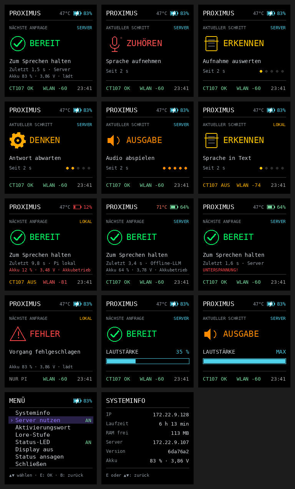
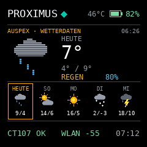

# PiTFT: Status und Animationen

Das **Adafruit mini PiTFT 1,3″**, 240 × 240 / ST7789, läuft über SPI unabhängig vom Sprachdienst. Die gezeigten Bilder sind **softwareseitig gerenderte Vorschauen**, keine Fotos des Pi.

| Status | Arbeitsschritte |
|:--:|:--:|
|  |  |

Auf der Anzeige erscheinen Zuhören, Erkennen, Denken, Synthese, Rendern, Ausgabe, Server/LOKAL, WLAN, Akku, Temperatur, Uhrzeit, Lautstärke, Menü und Fehlermeldungen. Servitor-Schädel/Billy-Gesicht und die Wettervorhersage sind integriert.



## Einrichtung und Test

SPI in `/boot/firmware/config.txt` per `dtparam=spi=on` aktivieren. **WM8960/I²S nicht überschreiben.** Danach neu starten.

```bash
sudo bash scripts/install-display.sh
sudo systemctl enable --now pi-display
systemctl status pi-display --no-pager
journalctl -u pi-display -n 30 --no-pager
```

GPIOs (BCM): MOSI 10, SCLK 11, CE0 8, D/C 25, Backlight 22, Tasten 23/24. Das Display liest feste Statuswerte aus `/run/pi-ptt/`; es speichert dort weder Transkripte noch Antworttexte.

## Energiesparstufen

Nach `PTT_REST_SECONDS` (Standard 30 s) dunkelt das Display ab; nach `PTT_SLEEP_SECONDS` (600 s) geht die Hintergrundbeleuchtung aus. Ein Tastendruck weckt es, auch im Schlaf kann das Aktivierungswort lauschen. Mit `PTT_SLEEP_WLAN=off` ist SSH in diesem Zustand nicht erreichbar.

**Offen:** abschließende Hardware-Abnahme der Tasten, LED, Wetteranimation und Lesbarkeit ([Roadmap](../roadmap.md)). Technische Messwerte zur Anzeige: [Display-Arbeitsschritte](../history/display-work-steps-2026-10-07.md).
