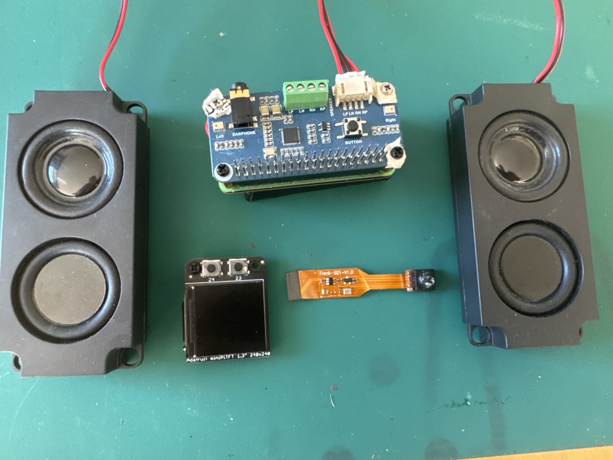
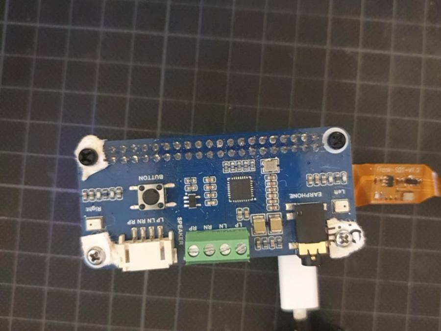
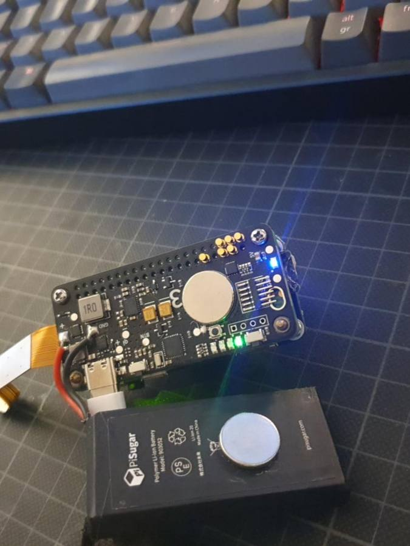
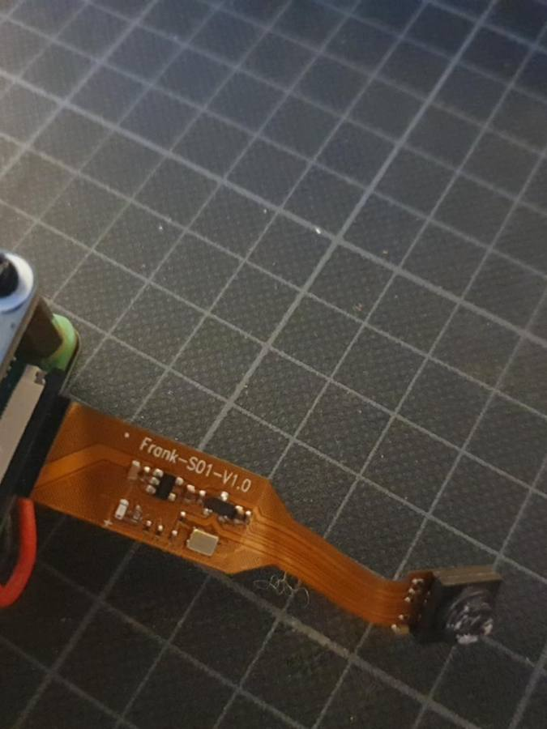
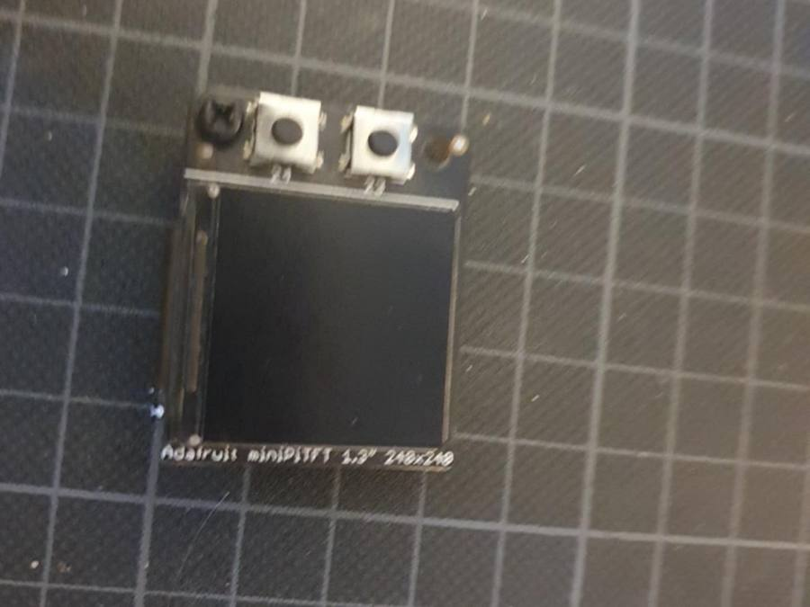

# Hardwarebestand und Fotodokumentation 🔧

Stand: 05.10.2026. Grundlage: Ivans Angaben und fünf Originalfotos. Sichtbare Beschriftungen sind von noch nicht geprüften technischen Details getrennt.

## Aktueller Aufbau — 05.10.2026 📸

In der Mitte ist das WM8960-HAT auf dem Pi-Stapel montiert. Links und rechts liegen die beiden Lautsprecher mit Anschlussleitungen; am HAT ist der weiße Lautsprecherstecker belegt. Die Leitungen verlaufen teilweise außerhalb des Bildes, daher lässt sich die vollständige Kanalverdrahtung aus diesem Foto nicht prüfen.

Das Adafruit mini PiTFT und die Kamera mit Aufdruck `Frank-S01-V1.0` liegen separat unterhalb des Stapels. Sie sind in dieser Aufnahme nicht montiert; die Kamera ist anders als auf den früheren Fotos nicht am Pi angeschlossen. PiSugar2 und Akku sind im Stapel nicht ausreichend sichtbar, um Revision oder Anschlusszustand erneut zu bestimmen.

Dies ist der Aufbau für die Audio-Inbetriebnahme. ALSA erkennt das WM8960 bereits als Aufnahme- und Wiedergabegerät; beim ersten Lautsprechertest wurde noch kein Ton gehört.

## Bestand

| Teil | Details und Beleg | Aufgabe |
|---|---|---|
| Raspberry Pi Zero 2 W | Projektbasis; im montierten Stapel nicht vollständig lesbar; 512 MB RAM laut Hersteller | Audio-Client |
| WM8960 Audio-HAT | Foto zeigt zwei Mikrofone, Taste, Lautsprecheranschlüsse und Kopfhörerbuchse | Audioaufnahme und Wiedergabe |
| Zwei Lautsprecher | Laut Ivan angeschlossen; im aktuellen Übersichtsfoto separat links und rechts dargestellt | Sprachausgabe |
| Integrierte Mikrofone | Zwei Mikrofone am HAT sichtbar; separates Mikrofon für MVP nicht nötig | Spracheingabe |
| HAT-Taste | Aufdruck `BUTTON`; Herstellerbelegung GPIO17, physischer Pin 11 | Aufnahme auslösen |
| PiSugar2 | Von Ivan benannt; Foto zeigt Stromversorgungsplatine, Akku und Status-LEDs | Akkubetrieb |
| Li-Ion-Akku | Aufdruck `PiSugar`, Modell `803052`; Kapazitätszeile nicht zuverlässig lesbar | Energiespeicher |
| Kamera | Zuvor angeschlossen, im aktuellen Übersichtsfoto separat abgelegt; Flexplatine trägt `Frank-S01-V1.0`; daraus kein sicherer Sensorname ableitbar | Spätere Bildanfragen |
| 64-GB-microSD | Von Ivan bestätigt; kein separates Foto | Betriebssystem |
| Adafruit mini PiTFT 1,3″ | Aufdruck `Adafruit miniPiTFT 1.3" 240x240`, zwei Taster | Optionale Statusanzeige |

## Audio-HAT

Am Board sichtbar: zwei Mikrofone, die zentrale Taste, weißer Lautsprecherstecker, grüne Schraubklemme und 3,5-mm-Kopfhörerbuchse. Ob ein Stecker und eine Klemme gleichzeitig belegt sind, sagt noch nichts über das tatsächliche Audiorouting aus. Die beiden Lautsprecher sind als vorhandene Hardware erfasst; Impedanz, Leistung und Wiedergabe müssen noch geprüft werden.

## Stromversorgung

Sichtbar sind Akku, Anschlussleitungen, Stromversorgungsplatine und leuchtende LEDs. Das Foto belegt keinen getesteten Ladezustand oder eine bestimmte Laufzeit. Die genaue PiSugar2-Revision und die Akkukapazität bleiben bis zum Ablesen offen.

## Kamera

Die früheren Fotos zeigen die Kamera über ein Flexkabel angeschlossen; im aktuellen Aufbau liegt sie separat neben dem Pi. Der lesbare Platinenaufdruck wird dokumentiert; das Sensormodell wird später mit rpicam/libcamera und gegebenenfalls weiteren Typenangaben ermittelt.

## Display

Das Foto identifiziert das Display als **Adafruit mini PiTFT 1,3″, 240 × 240**. Die frühere Einordnung als Waveshare Pico-LCD war falsch. Es ist ein Raspberry-Pi-Zusatzdisplay und benötigt für seinen vorgesehenen Einsatz keinen Raspberry Pi Pico. Es wird erst nach dem Audio-MVP angeschlossen und getestet. Laut Adafruit erlaubt die 1,3″-Variante kein einfaches Durchstecken eines Stacking-Headers durch die Platine. Montage oberhalb des Audio-HATs oder Anschluss per geeigneter Verlängerung separat planen.

## Schnittstellen und Planung

Alle GPIO-Angaben verwenden BCM-Nummern. Die Tabelle folgt den Herstellerbelegungen; der gemeinsame Aufbau ist noch nicht getestet.

| Bauteil | Schnittstelle / GPIOs | Prüfung |
|---|---|---|
| WM8960 Steuerung | I²C: GPIO2/3 | Bus zusammen mit PiSugar prüfen |
| WM8960 Audio | I²S: GPIO18/19/20/21 | Overlay und Treiber prüfen |
| HAT-Taste | GPIO17, physischer Pin 11 | Polarität und Entprellung prüfen |
| mini PiTFT | SPI: GPIO10/11, CS GPIO8, DC GPIO25; Backlight GPIO22 | Pinbelegung und Montage vor Anschluss abgleichen |
| Displaytaster | GPIO23/24 | Optional zusätzliche Bedienung |
| PiSugar2 | I²C; weitere Details revisionsabhängig | Adresse und Versorgung prüfen |
| Kamera | Kameraanschluss/Flexkabel | Sensor und Treiber prüfen |

Audio und Display nutzen nach dieser Belegung unterschiedliche Signalpins. Das ist eine Planungsgrundlage; mechanische Stapelbarkeit, Versorgung und weitere Funktionen der konkreten PiSugar-Revision werden gesondert geprüft.

## Noch offen

- PiSugar2-Revision, Akkukapazität und sauberes Abschaltverhalten.
- Kamerasensor und Testbild.
- Lautsprecherimpedanz, Leistung und Aufnahme-/Wiedergabetest.
- Endgültige Montage, Abstandshalter und Gehäuse.

## Quellen

Die fünf Fotos stammen von Ivan und sind hier als Projektfotos abgelegt.

- [Pi Zero 2 W](https://www.raspberrypi.com/products/raspberry-pi-zero-2-w/)
- [WM8960 Wiki und Pinbelegung](https://www.waveshare.com/wiki/WM8960_Audio_HAT)
- [Adafruit mini PiTFT 1,3″, Produkt 4484](https://www.adafruit.com/product/4484)
- [Adafruit Pinbelegung](https://learn.adafruit.com/adafruit-mini-pitft-135x240-color-tft-add-on-for-raspberry-pi/pinouts)
