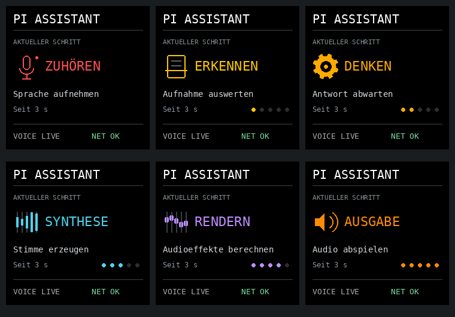
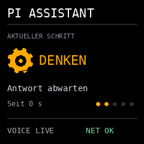

> **Historisches Protokoll.** Dieser Text dokumentiert die damaligen Messungen oder Entscheidungen; für den aktuellen Betrieb siehe [README](../../README.md), [Architektur](../../architecture.md) und [Roadmap](../../roadmap.md).

# Live work steps on the PiTFT

The 240×240 display shows recording, recognition, waiting for the LLM reply,
synthesis, effect rendering, and playback separately. Startup also distinguishes
loading the voice model from warming it up. Each step has a short description,
an elapsed-seconds counter, and a small icon. The thinking gear rotates once in
eight seconds. Five dots identify the response phase, not a completion estimate.

## Interface preview

Rendered with the display code and the Pi's actual fonts; these are interface
previews, not photographs of the physical screen. Each individual screen is
240 × 240 pixels.

### Thinking animation

The gear turns slowly while the assistant waits for the LLM response. The
counter shows elapsed time in the current step.

## Implementation and validation

Rendering is capped at four frames per second; fonts are cached. Only the changed rectangle is converted/transferred to SPI, using Pillow image differences. Repeated unchanged frames are skipped. Preview
rendering on the Pi measured 10.48 ms per frame, excluding SPI transfer.
Only fixed phase names and timestamps are published to the runtime progress
file. Neither microphone transcripts nor LLM reply text appear in that file.
A newer controller event supersedes older progress, so cancellation and errors
cannot be hidden by the previous synthesis/render phase. Idle Vosk model loading
does not overwrite an active recording screen.

The phase is published when processing starts, rather than when its duration
is logged at the end. The speech-start event is emitted before launching its
worker so it cannot overwrite an already-started synthesis phase.

Validation: the full 132-test suite passed on the Pi. After adding partial transfers, all 23 display tests passed, including two new pixel-reconstruction/retry tests. The six screens were rendered with the
Pi's actual font/Pillow environment and visually inspected. A fixed spoken
sentence tests synthesis, reference DSP rendering and playback while drawing
the corresponding states on the physical PiTFT. Test details and the backup
are in /home/obivan/pi-diagnostics/display-steps-20261007.

The real PiTFT/audio test observed SYNTHESE, RENDERN and AUSGABE in order, completed successfully and restored both services.
