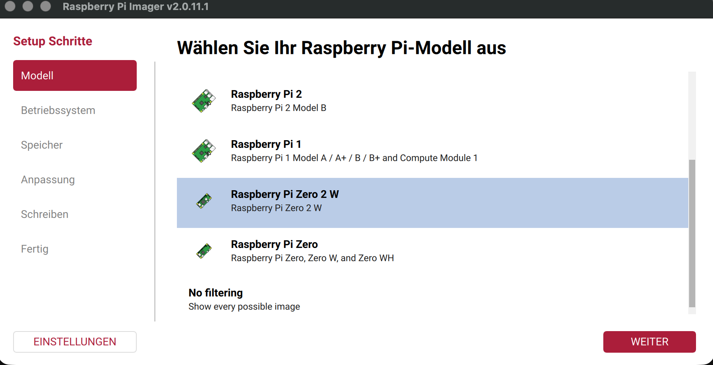
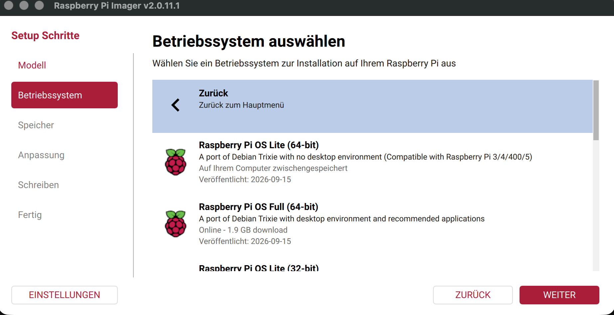
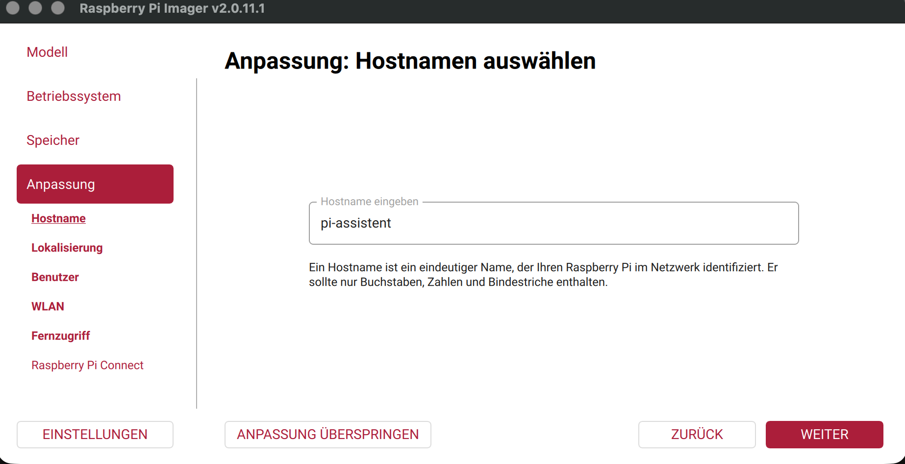
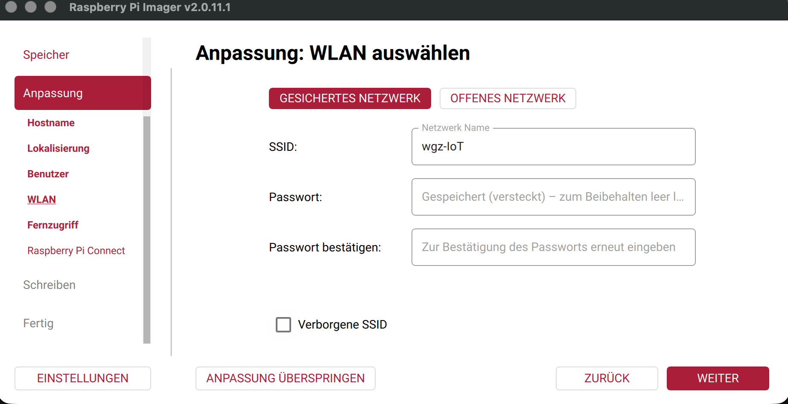
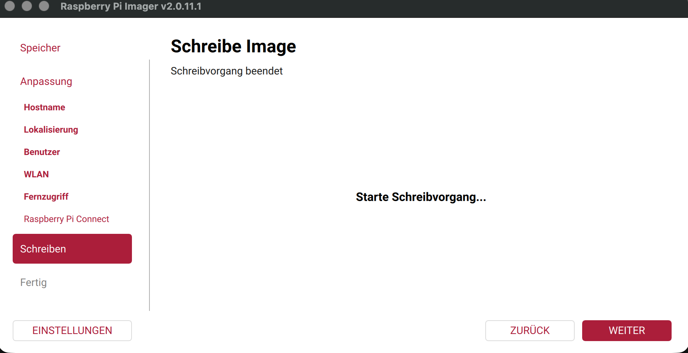
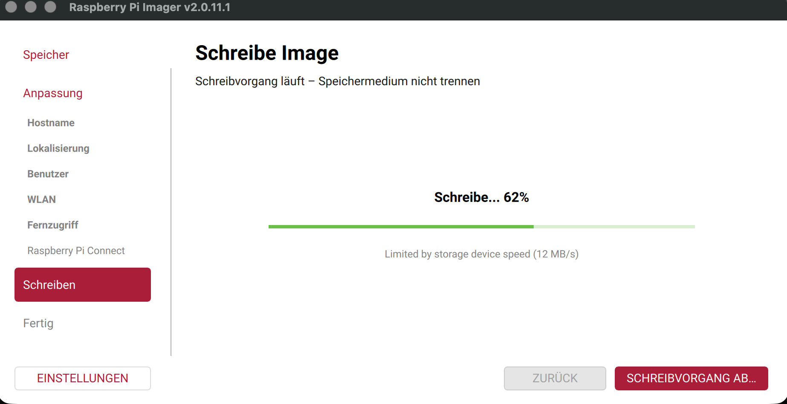
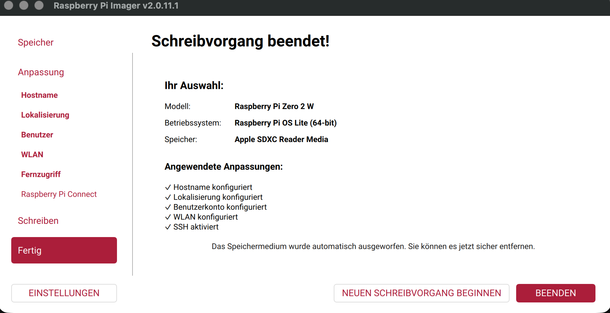
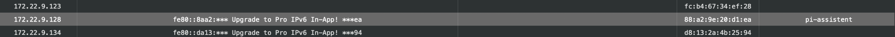

# Betriebssystem und erste Inbetriebnahme 🐧

## Basis und Entscheidungsstand

Festgelegt am 05.10.2026: **Raspberry Pi OS Lite (64-bit), Debian 13 / Trixie**, ohne Desktop. Die Begründung steht in [ADR 0002](decisions/0002-operating-system.md).

Betrieb: Headless über SSH, systemd für den Client, Python mit virtueller Umgebung, ALSA für WM8960 und später rpicam/libcamera für die Kamera.

Vor dem Flashen konkrete Image-Version, Architektur und Download-Prüfsumme dokumentieren. Boot und SSH sind bestätigt; die Kompatibilität der Hardwaretreiber bleibt zu prüfen.

Quelle: [Raspberry Pi OS Downloads](https://www.raspberrypi.com/software/operating-systems/).

## 1. SD-Karte vorbereiten

Mit Raspberry Pi Imager das vereinbarte Lite-Image auf die 64-GB-Karte schreiben. Das überschreibt die Karte; vorher benötigte Daten sichern. Hostname `pi-assistent`, Benutzer `obivan`, SSH (Passwortanmeldung bei der Erstinbetriebnahme bestätigt), 2,4-GHz-WLAN mit Land `DE` und Zeitzone `Europe/Berlin` konfigurieren. Der Zero 2 W benötigt ein 2,4-GHz-WLAN.

## Installationsprotokoll — 05.10.2026 📸

Raspberry Pi Imager **v2.0.11.1** auf macOS. Der Abschlussbildschirm bestätigt **Raspberry Pi Zero 2 W**, **Raspberry Pi OS Lite (64-bit)** sowie angewendete Anpassungen für Hostname, Lokalisierung, Benutzerkonto, WLAN und aktiviertes SSH. Das Image wird im Imager als **Debian Trixie**, veröffentlicht **2026-09-15**, angezeigt. Die Image-Prüfsumme wurde noch nicht erfasst; der laufende Kernel ist im folgenden Bootprotokoll dokumentiert.

Tatsächlicher Hostname: **`pi-assistent`** (ersetzt die ursprüngliche Planung `wgz-voice-01`). WLAN wurde eingerichtet. Die spätere SSH-Anmeldung bestätigt Benutzer `obivan` und Passwortauthentifizierung. WLAN-Land `DE` und Zeitzone `Europe/Berlin` bleiben zu überprüfende Planwerte.

**Bestätigt:** Schreibvorgang abgeschlossen und Karte automatisch ausgeworfen. Der Pi ist gestartet, im Netzwerk erreichbar und die SSH-Anmeldung funktioniert. **Noch offen:** Erreichbarkeit nach einem weiteren Neustart und Hardwaretests.

### Modell auswählen



### Betriebssystem auswählen



### Hostname konfigurieren



### WLAN konfigurieren



### SD-Karte schreiben





### Erfolgreicher Abschluss



Alle acht Originalscreenshots liegen unter `docs/images/setup/`. [Screenshot 04](images/setup/04-image.png) ist identisch mit Screenshot 03 und wird deshalb nur einmal eingebettet.

## Boot und erste SSH-Anmeldung — 05.10.2026 ✅

| Beobachtung | Bestätigter Wert |
|---|---|
| Hostname | `pi-assistent` |
| IPv4 beim ersten Start | `172.22.9.128` (kann sich ohne Reservierung ändern) |
| Benutzer | `obivan` |
| SSH | Anmeldung mit Passwort erfolgreich |
| Architektur | `aarch64` |
| Kernel | `6.18.50+rpt-rpi-v8` |
| Kernelpaket laut Loginbanner | `Debian 1:6.18.50-1+rpt1 (2026-09-11)` |




Der Login belegt einen erfolgreichen Boot und SSH-Zugriff über die IP-Adresse. mDNS (`pi-assistent.local`) und Erreichbarkeit nach einem weiteren Neustart wurden noch nicht bestätigt.

## 2. Erster Start

Per SSH mit `ssh obivan@pi-assistent.local` verbinden (alternativ die IP-Adresse verwenden) und Modell/OS erfassen:

```bash
cat /proc/device-tree/model
cat /etc/os-release
uname -a
free -h
lsblk
```

Betriebssystem aktualisieren und Diagnosewerkzeuge installieren:

```bash
sudo apt update
sudo apt full-upgrade
sudo apt install git alsa-utils i2c-tools
sudo reboot
```

Bei `[sudo] password for obivan:` das Benutzerpasswort eingeben; dabei werden keine Zeichen angezeigt. Bei `Continue? [Y/n]` bestätigt Enter die Vorgabe Ja. Wenn Paket-Hinweise mit `(press q to quit)` erscheinen, mit **q** den Betrachter schließen und die Aktualisierung fortsetzen lassen.

Nach `sudo reboot` wird die SSH-Verbindung getrennt. Danach erneut verbinden:

```bash
ssh obivan@172.22.9.128
```

Nach erfolgreicher Anmeldung den tatsächlich gestarteten Kernel und die Audioerkennung erfassen:

```bash
uname -r
aplay -l
arecord -l
lsblk -o NAME,SIZE,FSTYPE,MOUNTPOINTS
```

### Updateprotokoll — 05.10.2026

Die sieben eingereichten Screenshots wurden geprüft. Drei Bilder belegen die relevanten Schritte; Downloadfortschritt und überlappende Zwischenstände wurden weggelassen.

| Schritt | Nachweis / Status |
|---|---|
| Paketquellen aktualisieren | Debian Trixie, Updates, Security und Raspberry-Pi-Archiv abgerufen; anschließendes Upgrade zeigt 14 aktualisierbare Pakete |
| `apt full-upgrade` | 14 Aktualisierungen angekündigt, keine Neuinstallationen oder Entfernungen; spätere Ausgabe zeigt Paketkonfiguration und abgeschlossene Trigger vor Beginn der Werkzeuginstallation |
| Paket-Hinweise | rsync-Hinweise im Betrachter; mit **q** verlassen |
| `alsa-utils` | Bereits aktuell: `1.2.14-1+rpt1` |
| Git | Installation abgeschlossen: `1:2.47.3-0+deb13u1` |
| I²C-Werkzeuge | Installation abgeschlossen: `i2c-tools 4.4-2` |
| Neustart | SSH-Verbindung vom Pi geschlossen, passend zum zuvor eingegebenen `sudo reboot`; Bootabschluss noch nicht nachgewiesen |
| Erneute SSH-Anmeldung | Befehl eingegeben, aber noch kein Loginbanner oder Shellprompt sichtbar |
| Audioerkennung | Ausgaben von `aplay -l` und `arecord -l` stehen aus |


Die Updateausgabe referenziert Kerneldateien für `6.18.50+rpt-rpi-v8`. Das belegt noch nicht den nach dem Neustart laufenden Kernel; dafür ist `uname -r` erforderlich. APT zeigt **27,1 GB verfügbaren Platz** an. Dieser Wert ist die freie Kapazität des Dateisystems und bestätigt nicht die Größe der eingelegten SD-Karte; die geplanten 64 GB werden mit `lsblk` geprüft.

## 3. Audio zuerst

Den [Herstellerleitfaden](https://www.waveshare.com/wiki/WM8960_Audio_HAT) und den [Treiber](https://github.com/waveshareteam/WM8960-Audio-HAT) für den ausgewählten Kernel prüfen. Installationsskript vor Ausführung lesen und verwendeten Commit festhalten. Alte Wiki-Beispiele sind keine Kompatibilitätszusage für aktuelle Kernel. Keine automatische Treiberinstallation in diesem Repository.

Nach Installation und Neustart:

```bash
aplay -l
arecord -l
alsamixer
```

Erkannten Kartenbezeichner in `AUDIO_CARD` einsetzen. Leise beginnen:

```bash
AUDIO_CARD=wm8960soundcard # Durch den erkannten Kartenbezeichner ersetzen
speaker-test -D "plughw:CARD=${AUDIO_CARD},DEV=0" -c 2 -t wav -l 1
arecord -D "plughw:CARD=${AUDIO_CARD},DEV=0" -f S16_LE -r 16000 -c 2 -d 5 /tmp/pi-voice-test.wav
aplay -D "plughw:CARD=${AUDIO_CARD},DEV=0" /tmp/pi-voice-test.wav
rm /tmp/pi-voice-test.wav
```

Das Aufnahmeformat ist ein Testvorschlag. Bei Formatfehlern unterstützte Hardwareparameter ermitteln und anpassen. Aufnahmepegel und Mikrofonrouting in `alsamixer` prüfen.

## 4. Weitere Komponenten

Erst nach erfolgreichem Audio-Test Taste und Entprellung testen. Danach PiSugar2-Variante bestimmen, Herstelleranleitung anwenden und kontrolliertes Herunterfahren prüfen. Kamera und Display folgen später.

## Abnahmeprotokoll

| Prüfung | Ergebnis |
|---|---|
| Modell, Image, Architektur, Kernel dokumentiert | Offen |
| Treibercommit dokumentiert; keine Installationsfehler | Offen |
| Beide Lautsprecher hörbar | Offen |
| Mikrofonaufnahme verständlich | Offen |
| Taste zuverlässig erkannt | Offen |
| WLAN/SSH nach Neustart verfügbar | Offen |
| Akku-/Abschaltverhalten geprüft | Offen |

SD-Karte, erster Boot und SSH-Anmeldung am 05.10.2026 bestätigt. Systemupdate und Werkzeuginstallation sind bestätigt. Erneute SSH-Anmeldung nach dem angestoßenen Neustart, laufender Kernel und Hardwaretests stehen aus.
